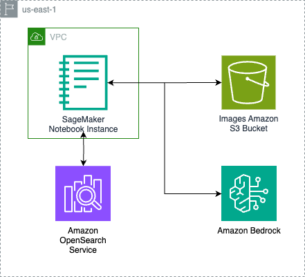

# VRAG

## Solution Overview:

## Architecture:

### Deploy to AWS
| Region                | Launch Template                                                                                                                                                                                                                                                                                                             |
|-----------------------|-----------------------------------------------------------------------------------------------------------------------------------------------------------------------------------------------------------------------------------------------------------------------------------------------------------------------------|
 | US East (N. Virginia) | [](https://console.aws.amazon.com/cloudformation/home?region=us-east-1#/stacks/new?stackName=video-rag&templateURL=https://github.com/aws-samples/sample-video-rag/blob/main/cft-video-generation-blog.yml) |
 
Note: Nova Reels is only supported in us-east-1


### Network Infrastructure
- VPC with public and private subnets
- NAT Gateway for outbound internet access from private subnets
- Internet Gateway for public subnet
- VPC Flow Logs for network monitoring

### Compute Resources
- SageMaker Notebook Instance in a private subnet
- Custom lifecycle configuration for notebook setup
- Security groups with restricted access

### Storage
- S3 bucket for data storage with versioning enabled
- Separate logging bucket for access logs
- Server-side encryption (AES-256)
- Bucket policies for secure access

### Search Infrastructure
- OpenSearch Serverless collection optimized for vector search
- Security policies for encryption and network access
- Access policies for fine-grained control

### Security
- KMS key for notebook encryption
- IAM roles with least privilege access
- VPC endpoint for secure OpenSearch access
- Private subnet placement for notebook instance

## Project Structure
```
.
├── README.md
├── assets
│ └── architecture.png                                    # Architecture diagram
├── bedrock_multimodal_pipeline_step_1.ipynb              # Jupyter Notebooks 
├── bedrock_multimodal_pipeline_step_2.ipynb
├── bedrock_multimodal_pipeline_step_3.ipynb
├── bedrock_multimodal_pipeline_step_4.ipynb
├── bedrock_multimodal_pipeline_step_5-Multi.ipynb
├── bedrock_multimodal_pipeline_step_5.ipynb
├── cft-video-generation-blog.yml                         # Cloudformation template
├── images/                                               # Sample images for demo purposes 
└── requirements.txt                                      # Dependencies
```


## Authors and Reviewers
 * Nick Biso, Machine Learning Engineer - Amazon Web Services Inc.
 * Vishwa Gupta, Senior Data Architect  - Amazon Web Services Inc.
 * Madhunika Reddy Mikkili, Data & ML Engineer - Amazon Web Services Inc.
 * Seif Elharaki, Machine Learning Engineer - Amazon Web Services Inc.
 * Shuai Cao, Data Science Manager - Amazon Web Services Inc.


## Security

See [CONTRIBUTING](CONTRIBUTING.md#security-issue-notifications) for more information.

## License

This project is licensed under the Apache-2.0 License.

